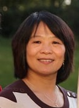

```

Mei-Yuh Hwang
Affiliate Professor at EE Department
University of Washington
mhwang at ee dot washington dot edu
```

 Mei-Yuh received her PhD in Computer Science from Carnegie Mellon
University in 1993 and had worked at Microsoft in U.S. and in China
for 18 years, publishing numerous conference and journal papers,
  and delivering industry products in speech recognition, machine
  translation, and language understanding. Additionally she spent four years at Uiniversity of Washington on Mandarin speech recognition for DARPA EARS and GALE projects
during 2004-2008, and four years at an AI startup, [Mobvoi](http://www.mobvoi.com), from 2016 through early 2020.
She is an IEEE fellow,
who is passionate in bridging the gap between academia and
industry. She is currently with [Microsoft MSAI](https://www.microsoft.com/en-us/research/people/mehwang/) team.

